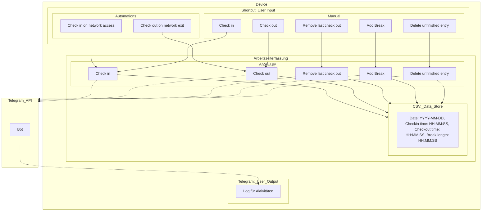

# ZeEr.py
ZeEr.py ist ein Python Skript, das als Grundlage zur automatisierten Arbeitszeiterfassung dient.

## Initiales Setup
Vor Benutzung des Skripts muss eine .csv Datei erstellt und deren Pfad am Anfang des Skriptes in die entsprechende Variable kopiert werden.  
Optional können die Parameter für den Telegram Bot eingetragen werden.
Diese werden nur benötigt, wenn man **-t** nutzt.

## Aufbau
Das Skript modifiziert und wertet die spezifizierte .csv Datei aus.
Die Argumente mit denen man das Skript aufruft bestimmt die ausgeführte Funktion.

## Funktionen
Dem Nutzer stehen fünf Funktionen zur Verfügung:

### Einstempeln / Check-In **-i**
Das Einstempeln legt einen Eintrag für den heutigen Tag an und hält den aktuellen Zeitpunkt als Beginn fest.

### Ausstempeln / Check-Out **-o**
Das Ausstempeln fügt bei dem Eintrag für den heutigen Tag die aktuelle Uhrzeit als Ende ein.

### Unvollständigen Eintrag löschen **-d**
Hat der letzte Eintrag keinen Check-Out, kann man ihn mit dieser Funktion löschen.  
Das kann nützlich sein, wenn unbeabsichtigt eingestempelt wurde.

### Heutigen Check-Out entfernen **-r**
Wurde ausversehen ausgestempelt, kann man den Check-Out mit dieser Funktion entfernen.

### Pause hinzufügen **-b int**
Pausen, die nicht Teil der täglichen 60 minütigen Mittagspause sind können zusätzlich eingetragen werden.  
Die Länge der Pause wird in Minuten angegeben.  
Nutzt man diese Funktion mehrmals an einem Tag, werden die eingetragenen Pausen addiert.  
Mit einem negativen Wert kann man von der eigetragenen Pausenzeit entfernen.

## Flag **-t** - Telegram
Je nach Verwendungszweck kann es sinnvoll sein, den Output des Skriptes über einen Telegram Bot zu versenden.  
Wird **-t** nicht verwendet, wird der Output an die Standartausgabe geschickt.

---

# Automatisierung am Beispiel von IOS

Nutzt man die Shortcuts beziehungsweise Kurzbefehle App von Apple, kann man eine Automatisierung beim Verbinden oder Trennen von einem Netzwerk einrichten, die ZeEr.py mit der IOS App Pyto ausführt.

